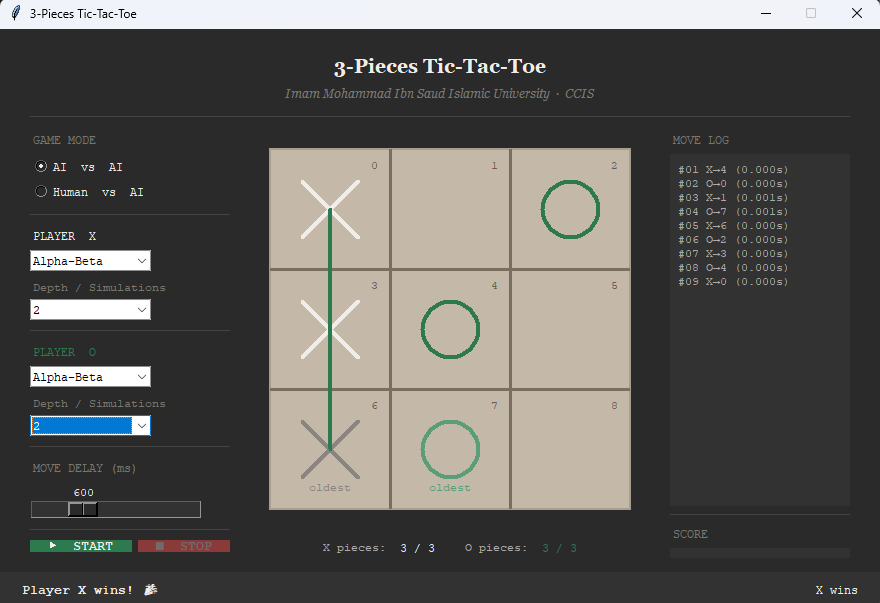
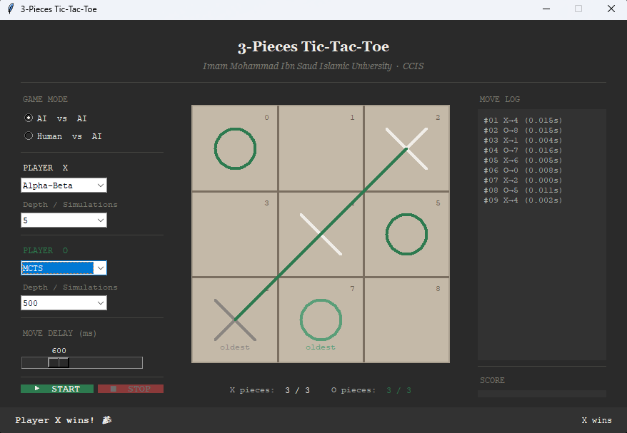
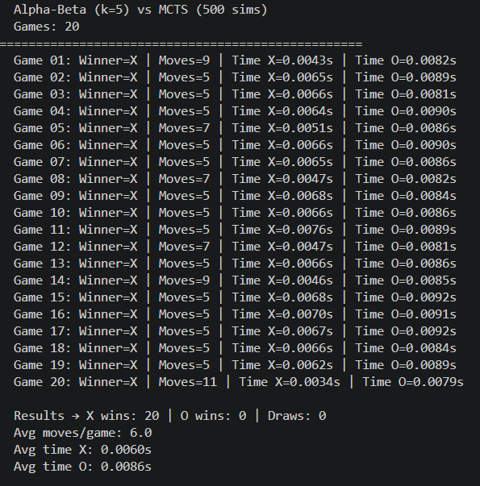

# Tic-Tac-Toe: Alpha-Beta vs MCTS

A tic tac toe variant where each player only keeps 3 pieces on the board at a time. Placing a 4th piece removes your oldest one. Includes two AI agents to play against, or against each other: Minimax with alpha beta pruning, and Monte Carlo Tree Search.



## Run it

```
python main.py
```

Needs Python 3 with tkinter, no extra packages required.

## The two agents

Pick either agent for either player, including AI vs AI matches between the two:



`experiments.py` runs a batch of games between the two agents and reports win rates, average game length, and average move time:



## Files

- `game.py` - board state and game rules
- `alpha_beta.py` - minimax agent with alpha beta pruning
- `mcts.py` - Monte Carlo Tree Search agent
- `gui.py` - tkinter interface
- `experiments.py` - compares the two agents against each other
- `main.py` - entry point
